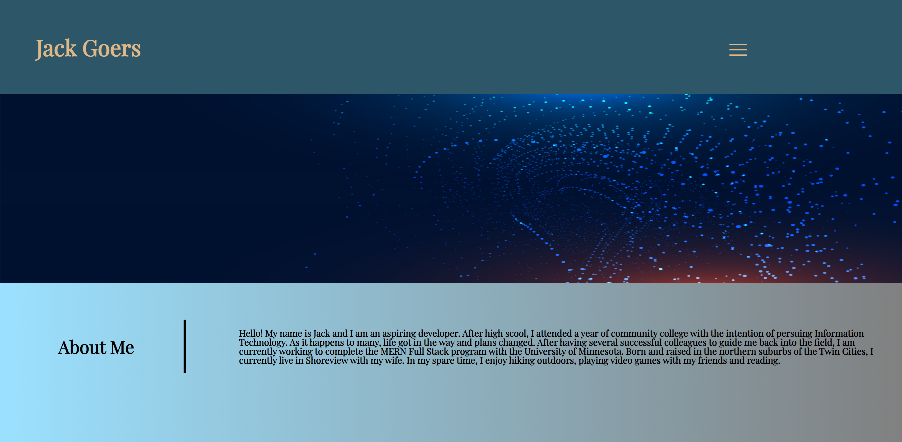
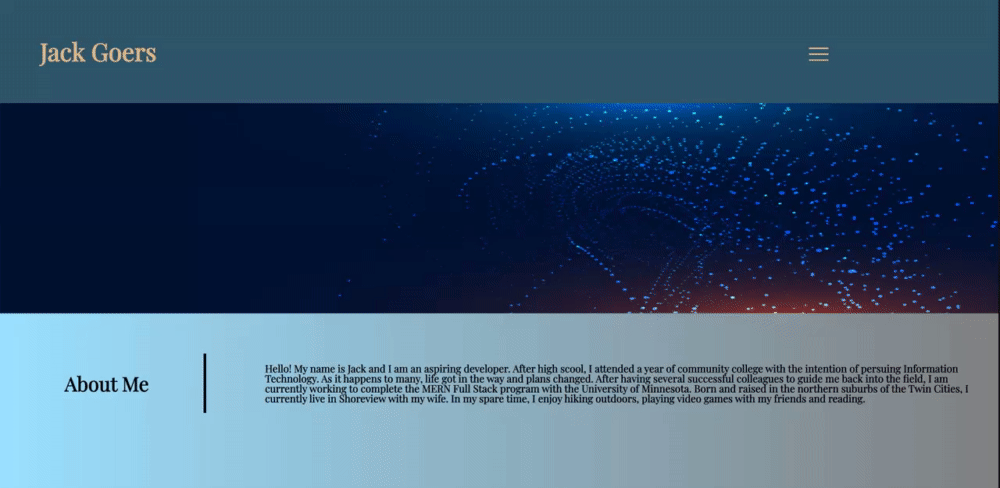

#Jack Goers | Portfolio
​
## Description: Thanks for checking out my portfolio. This page is my first project with the UofM full stack program and will serve as a collection of my works moving forward. 

# Usage 
​
This profile page will serve as my collction space for upcoming projects.
​
md

​
​
## Credits
​
All work done by me. 
Images origin links:
-https://www.pexels.com/photo/matrix-background-1089438/
-https://www.pexels.com/photo/apps-blur-button-close-up-267350/
-https://pixabay.com/photos/computer-screen-coding-1209641/

Guinea pig image by my Wife, Kayla Snyder

​
Images origin links:
-https://www.pexels.com/photo/matrix-background-1089438/
-https://www.pexels.com/photo/apps-blur-button-close-up-267350/
-https://pixabay.com/photos/computer-screen-coding-1209641/
-https://img.freepik.com/free-vector/digital-technology-particle-wide-banner-with-light-effect_1017-26317.jpg?size=626&ext=jpg&ga=GA1.2.1005813686.1613606400
​
